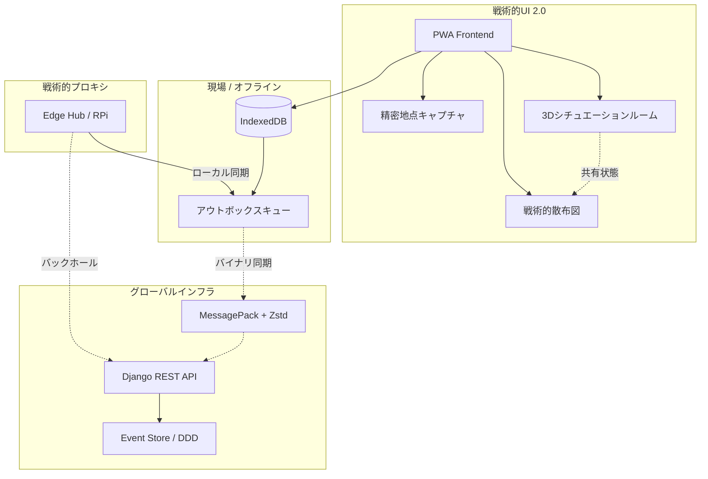

# MG Location: レジリエント戦術マップ & 3Dシチュエーションルーム v1.2


[English](./README.md) | **日本語** | [Português](./README.pt.md)

**MG Location** は、自然災害（洪水、土砂崩れ、人道危機）シナリオにおける意思決定支援と運用調整のためのシステムです。主な目的は、ネットワークインフラが壊滅的な故障をきたした場合でも、**100%の運用可用性**を保証することです。

---

## 🎯 ミッション
複雑なデータを即時の戦術的行動に変換すること。MG Location は単なるダッシュボードではなく、インターネットが届かない場所でも機能するように設計されたフィールドツールです。

---

## 🏗️ レジリエンス・アーキテクチャ (v1.2)

バージョン 1.2 では、**Resilience-First** 設計の強化と、新たな **戦術的視覚化レイヤー** が導入されました：



1. **Local-first (Offline Outbox)**: PWA アプリは IndexedDB を使用してインターネットなしで動作します。アクションは同期待ちキューに入れられ、接続時に自動同期されます。
2. **バイナリプロトコル (MessagePack + Zstd)**: 低帯域幅環境向けにデータトラフィックを最大 80% 削減。
3. **イベントソーシング (DDD)**: 全てのシステム変更を不変のイベントとして扱い、自動的な競合解決を実現。
4. **没入型3D視覚化**: リアルタイムで深い状況認識を可能にする新たな空間レンダリングレイヤー。

---

## 🚀 仕組み

### 1. 3Dシチュエーションルーム (v2.0)
**Three.js** を使用した没入型戦術環境。イベントを脈動する 3D ビーコンとして視覚化し、災害の空間的クラスター化と深度把握を可能にします。

### 2. 標準化されたAPIとヘルスモニタリング
**ASPNET Core v10** との堅牢な統合。高可用性監視のための専用エンドポイントが含まれています：
- `GET /api/health`: サービスのステータスとアップタイムの確認を提供します。

### 3. 戦術分析 (Scatter Plot 2.0)
...
### クイックスタート (Docker)
```bash
./dev.sh up
```
- **アプリ**: `http://localhost:8088` (Frontend React)
- **API**: `http://localhost:8001` (.NET Backend)
- **ヘルスチェック**: `http://localhost:8001/api/health`

### データシード (重要)
ブラジル・ミナスジェライス州ウバ（Ubá）の洪水シミュレーションデータを投入するには：
```bash
./dev.sh seed
```

---

## 📂 プロジェクト構成

```bash
├── backend-dotnet/     # ASP.NET Core 10 Web API
├── frontend-react/     # React 19 + Vite アプリケーション
├── agents/             # AI エージェントと自動化
├── docs/               # 詳細なドキュメントと計画
├── dev.sh              # DX 用の戦術的ツール
└── Dockerfile.*        # 環境定義
```

---

## 📑 詳細ドキュメント
- 📖 [現在のアーキテクチャ](docs/ARCHITECTURE_CURRENT.md)
- ⚖️ [透明性ポリシー](docs/PRIVACY_TRANSPARENCY_POLICY.md)
- 🧪 [テスト計画](docs/SECURITY_TEST_CHECKLIST.md)

---

**MG Location © 2026** - レジリエントなテクノロジーで命を救うために開発されました。
