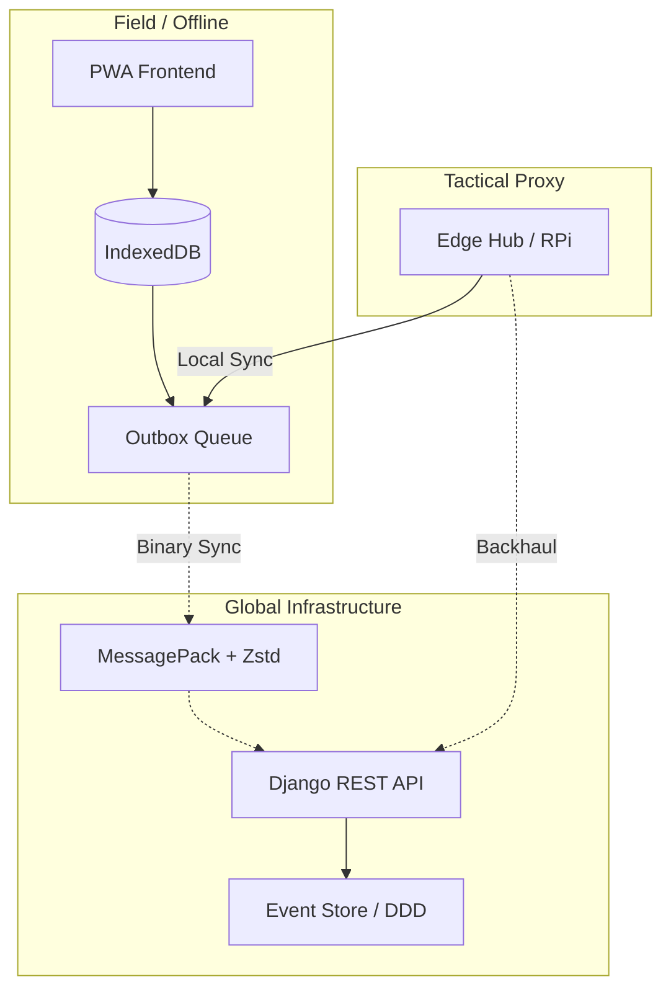
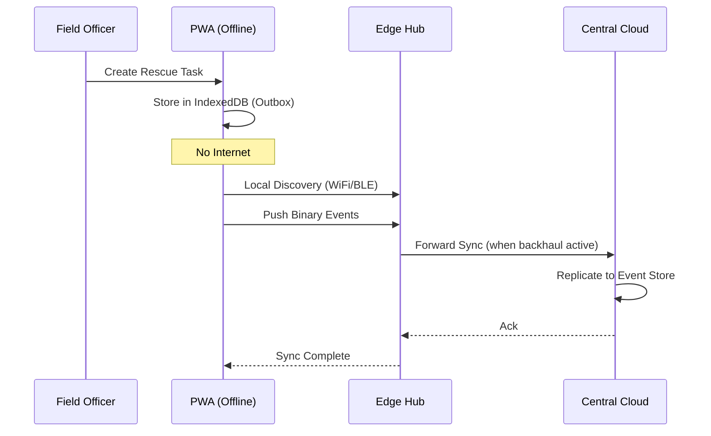

# MG Location: Tactical Disaster Response Platform v1.1


**English** | [日本語](./README.ja.md) | [Português](./README.pt.md)

**MG Location** is a decision support and operational coordination system for natural disaster scenarios (floods, landslides, humanitarian crises). The primary goal is to ensure **100% operational availability**, even under catastrophic network infrastructure failure.

---

## 🎯 Our Mission
To transform complex data into immediate tactical actions. MG Location is not just a dashboard; it is a field tool designed to work where the internet does not reach.

---

## 🏗️ Resilience Architecture (v1.1)

Version 1.1 introduced the **Resilience-First** redesign, focused on four fundamental pillars:



1. **Local-first (Offline Outbox)**: The PWA app works without internet using IndexedDB. Actions are queued and automatically synchronized when connectivity is restored.
2. **Binary Protocol (MessagePack + Zstd)**: We replaced heavy JSON with MessagePack compressed with Zstandard, reducing data traffic by up to 80% — vital for radio or satellite links.
3. **Event-Souring (DDD)**: All system changes are treated as immutable events. This allows for automatic conflict reconciliation (CRDT-lite) and a full audit trail.
4. **Edge Hubs (Decentralized Command)**: Support for local servers (like Raspberry Pi) that serve as tactical proxies in isolated areas.

---

## 🚀 How It Works

### 1. Command Center
Real-time visualization of rain alerts, risk areas, and rescue team status. Integrates intelligence from **GDACS**, **USGS**, and **INMET**.

### 2. Search & Rescue Operations
Tactical module for task assignment, search area demarcation, and tracking teams in the field.

### 3. Logistics & Donations
Transparent resource management, fundraising campaigns, and operational expense control.

### 4. Temporal Analysis (Scatter Plot)
A tactical scatter plot that allows analyzing the severity of events versus time, integrating local and global events into a single strategic view.

---

## 🛠️ Technology Stack

- **Frontend**: React 19, Vite, Tailwind CSS (Modern tactical design).
- **Backend**: Django 5.x, Django REST Framework (Robust core).
- **Data**: Postgres + Redis (Central) | IndexedDB (Local/App).
- **Protocols**: MessagePack, Zstandard, RESTful Events.
- **SSO/Auth**: Keycloak (Enterprise-level identity management).

---

## 📉 Operation Flow



---

## 💻 Getting Started

### Prerequisites
- Docker & Docker Compose
- Node.js / Bun (optional for local)
- Python 3.11+ (optional for local)

### Quick Start (Docker)
```bash
./dev.sh up
```
- **App**: `http://localhost:8088`
- **API**: `http://localhost:8001`

### Seed Data (Important)
To see the system populated with flood simulation data in Ubá (MG, Brazil):
```bash
./dev.sh seed
```

---

## 🤝 Invite for Contribution

This is an **Open Source** project with real social impact. We need help in several areas:

- **Developers**: Optimization of synchronization algorithms, new AI modules.
- **UX Specialists**: Improving the interface for use under stress and high brightness.
- **GIS Specialists**: Integration of more terrain models and satellite layers.
- **Data Analysts**: Creation of predictive risk models.

### How to join?
1. Read our [Onboarding Guide](docs/PROJECT_CONSOLIDATION_MG_LOCATION.md).
2. Explore the [Implementation Gaps](docs/DEEP_IMPLEMENTATION_GAP_PLAN.md).
3. Open an *Issue* or submit a *Pull Request* with your ideas.

---

## 📂 Project Structure

```bash
├── apps/               # Django Applications (Backend)
├── frontend-react/     # React Application (Frontend)
├── agents/             # AI Agents & Automation
├── docs/               # Deep documentation & plans
├── dev.sh              # Tactical pocket knife for DX
└── Dockerfile.*        # Environment definitions
```

---

## 📑 Detailed Documentation
- 📖 [Current Architecture](docs/ARCHITECTURE_CURRENT.md)
- ⚖️ [Transparency Policies](docs/PRIVACY_TRANSPARENCY_POLICY.md)
- 🧪 [Test Plan](docs/SECURITY_TEST_CHECKLIST.md)

---

**MG Location © 2026** - Developed to save lives with resilient technology.
