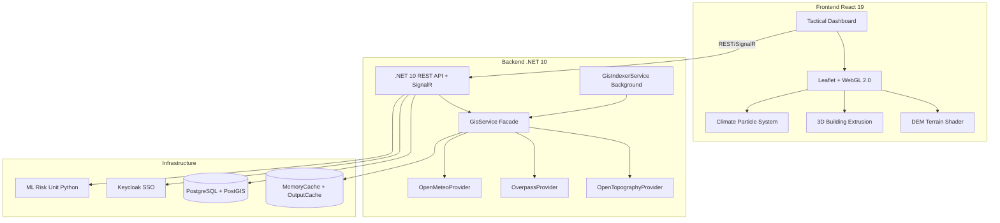

# SOS Location v3.0


**English** | [Português](./README.pt.md) | [日本語](./README.ja.md)

**SOS Location** é uma plataforma de apoio à decisão e coordenação tática para cenários de desastre. Na v3.0 incorpora um motor de **renderização 3D de cidades inteiras** (Brasil e Japão), capaz de reconstruir topografia, edificações, vias, vegetação e clima a partir de fontes abertas.

---

## 🎯 Our Mission

Bridge the gap between field data and strategic coordination. SOS Location provides specialized tools for each profile in the ecosystem — from first responders to command centers — ensuring resources reach those in need precisely and quickly.

> **Technology should not only optimize businesses — it should also help protect human life and the environment.**

---

## 🌆 City-Scale 3D GIS Simulation (v3.0)

The new **City-Scale Simulation** engine reconstructs entire urban environments for disaster training and real-time coordination:

- **Topography**: DEM elevation grids from OpenTopography (SRTMGL1, 30m resolution)
- **Buildings**: Floor count, height, usage from OpenStreetMap via Overpass API
- **Roads**: Highway network, pavement type, lane count from OpenStreetMap
- **Vegetation**: Forests, parks, green areas with density estimation
- **Climate**: Real-time temperature, wind, precipitation from Open-Meteo
- **Municipal Data**: Integration with IBGE (Brazil) and G-XML/GSI (Japan) for detailed cadastral data

All data is **indexed automatically** via `GisIndexerService` (background service) and cached for low-latency simulation rendering.

---

## 👥 Operational Roles & Features

### 🏛️ Dashboard Tático (Admin & Responder)
- **SOSPage** (`/app/sos`): HUD tático em tempo real com mapa, alertas, missões
- **SimulationsPage** (`/app/simulations`): Fullscreen 3D simulation with floating tactical controls
- **GlobalDisastersPage** (`/app/global-disasters`): Card grid of active global events
- **SettingsPage** (`/app/settings`): Service health monitoring + source configuration

### 🌐 Portal Público
- **PublicPortalMap** (`/`): Mapa público com incidentes e alertas
- **PublicIncidentDashboardPage** (`/transparency`): Portal de transparência com KPIs

---

## 🏗️ Architecture (v3.0)



---

## 🚀 Getting Started

```bash
# Clone and start everything
git clone https://github.com/your-org/sos-location.git
cd sos-location
./dev.sh up
```

| Service | URL |
|---|---|
| Operations Dashboard | http://localhost:8088 |
| API Health | http://localhost:8001/api/health |
| Swagger | http://localhost:8001/swagger |
| Risk ML Unit | http://localhost:8090 |
| Logs (Dozzle) | http://localhost:9999 |
| Keycloak SSO | https://localhost:8080 |

### Seed Simulation Data
```bash
./dev.sh seed
```

---

## 📂 Project Structure

```
sos-location/
├── backend-dotnet/           # .NET 10 Clean Architecture API
│   ├── SOSLocation.API/      # Controllers, Middleware, SignalR
│   ├── SOSLocation.Application/  # CQRS, MediatR, DTOs
│   ├── SOSLocation.Domain/   # Entities, Interfaces, Rules
│   └── SOSLocation.Infrastructure/  # EF Core, GIS Providers, Cache
│       └── Services/Gis/
│           ├── GisOptions.cs           # Config (URL, intervals, cache TTL)
│           ├── GisService.cs           # Facade coordinator
│           ├── GisIndexerService.cs    # Background indexer
│           └── Providers/
│               ├── IGisDataProvider.cs
│               ├── OpenTopographyProvider.cs
│               ├── OverpassProvider.cs
│               └── OpenMeteoProvider.cs
├── frontend-react/           # React 19 + Vite + Chakra UI
│   └── src/
│       ├── pages/            # Route components
│       ├── components/       # UI components (HUD, Panels, Sidebar)
│       └── store/            # Zustand stores
├── risk-analysis-unit/       # Python FastAPI ML Risk Engine
├── infra/                    # Docker configs, Keycloak realm, certs
├── docs/                     # Architecture, domain, compliance docs
├── .workflow/agents/         # AI agents for dev automation
└── docker-compose.yml
```

---

## ⚙️ Environment Variables

Copy `.env.example` to `.env`:

```env
# GIS Data Providers
OPENTOPOGRAPHY_URL=https://portal.opentopography.org/API/globaldem
OVERPASS_URL=https://overpass-api.de/api/interpreter
OPENMETEO_URL=https://api.open-meteo.com/v1/forecast
GIS_INDEXING_INTERVAL_MINUTES=30
GIS_CACHE_EXPIRATION_MINUTES=15

# Auth
KEYCLOAK_ADMIN=admin
KEYCLOAK_ADMIN_PASSWORD=admin
KEYCLOAK_PORT=8080

# Alerts
INMET_URL=https://apiprevmet3.inmet.gov.br/avisos/ativos
```

---

## 📑 Documentation

| Doc | Description |
|---|---|
| [Architecture v3.0](docs/PROJECT_ARCHITECTURE.md) | Full system architecture |
| [Domain Specification](docs/DOMAIN_SPECIFICATION.md) | DDD domain model |
| [Integrations](docs/INTEGRATIONS.md) | External APIs and data sources |
| [Security Audit](docs/SECURITY_AUDIT_REPORT.md) | RBAC, CSP, compliance |
| [AI Agents](./workflow/agents/) | Automated development agents |

---

## ❤️ Ethical Commitment

> [!IMPORTANT]
> **COMPROMISSO ÉTICO / ETHICAL COMMITMENT / 倫理的声明**
>
> This platform is driven by the mission to **SAVE LIVES** during natural disasters and humanitarian crises. The use of this platform for military purposes, warfare activities, or conflict simulations does not align with our core values.
>
> Este projeto é movido pela missão de **SALVAR VIDAS**. O uso para fins militares ou bélicos não se alinha com nossos valores fundamentais.

---

**SOS Location © 2026** — Developed to save lives with resilient technology.
