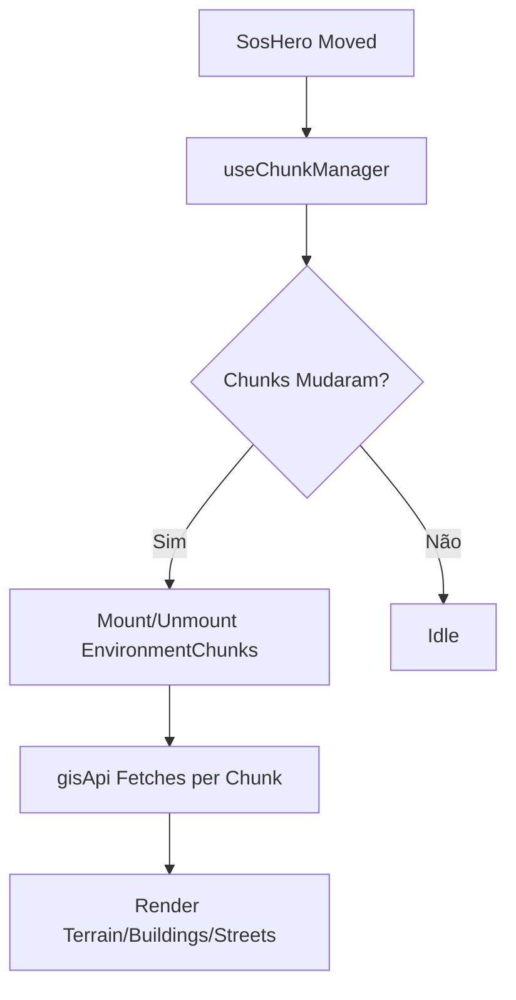

# SOS Location: Guia do Desenvolvedor

## Visão Geral
O **SOS Location** é um motor de consciência situacional 3D projetado para resposta a desastres. Ele utiliza dados geoespaciais reais (OSM, SRTM) renderizados dinamicamente via Three.js.

## Componentes Principais

### `Tactical3DMap.tsx`
O core da visualização. Ele orquestra a cena Three.js, o sistema de partículas de clima e o posicionamento da câmera.

### `SosHero.tsx`
Representa o agente no campo (Pegman).
- **Funcionalidade**: Drag & Drop (XZ Plane).
- **Interação**: Ao ser movido, ele dispara o recarregamento de chunks no `useChunkManager`.

### `useChunkManager.ts`
Hook que calcula quais áreas do mapa devem estar ativas.
- **Input**: Latitude/Longitude do Herói.
- **Output**: Array de chunks ativos com suas Bounding Boxes (BBOX).

### `EnvironmentChunk.tsx`
Wrapper que contém as camadas de dados para uma área específica.
- **Refatoração**: Todos os componentes filhos (`TerrainMesh`, `TacticalStreets`, etc) agora aceitam um `overrideBox` para evitar dependência do estado global de "Simulation Box" única.

## Como Contribuir
1. **Novas Camadas**: Implemente o componente e adicione ao `EnvironmentChunk`.
2. **Performance**: Mantenha o uso de `InstancedMesh` para vegetação e marcadores.
3. **Estilo**: Siga o padrão *Cybernetic Tactical* (Slate 950 + Cyan/Yellow accents).

## Diagrama de Fluxo

