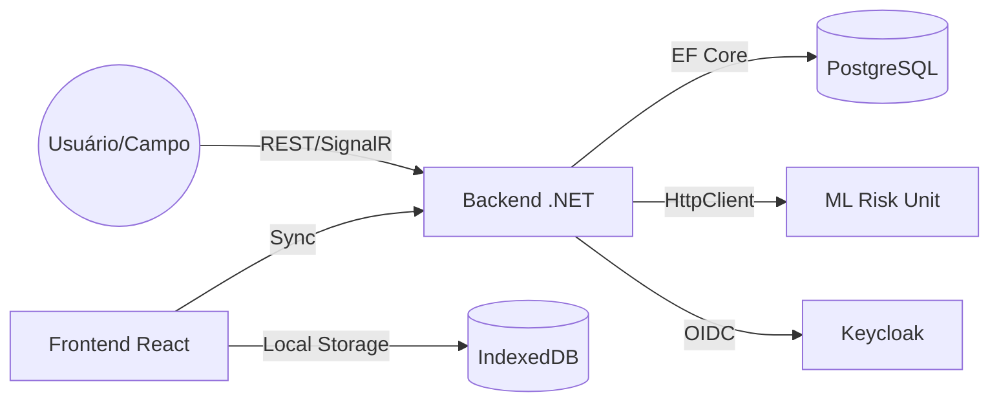

# Arquitetura SOS Location (v2.2)

Este documento descreve a arquitetura técnica da plataforma **SOS Location**, detalhando os padrões de design, tecnologias e integrações entre Backend, Frontend e Banco de Dados.

---

## 1. Visão Geral do Sistema

O SOS Location é uma plataforma de suporte à decisão e coordenação tática para cenários de desastres. Sua arquitetura é focada em **resiliência**, permitindo operação em ambientes com conectividade degradada ou inexistente através de uma abordagem *Offline-First*.

---

## 2. Backend (.NET 10)

O backend segue os princípios de **Clean Architecture** e **Domain-Driven Design (DDD)**, garantindo separação de preocupações e facilidade de manutenção.

### Estrutura de Camadas
*   **SOSLocation.API**: Camada de entrada (Controllers), configuração de Middlewares, Autenticação e SignalR.
*   **SOSLocation.Application**: Lógica de aplicação, DTOs, Mapeamentos e Handlers (MediatR). Implementa o padrão CQRS para separar comandos de consultas.
*   **SOSLocation.Domain**: O coração do sistema. Contém Entidades, Agregados, Value Objects, Exceções de Domínio e interfaces de Repositórios.
*   **SOSLocation.Infrastructure**: Implementações técnicas, como persistência de dados (EF Core), integração com serviços externos (Weather API, ML Unit) e brokers de mensagens.

### Tecnologias Chave
*   **ASP.NET Core 10**: Framework de alta performance.
*   **MediatR**: Desacoplamento de componentes via In-Process Messaging.
*   **SignalR**: Comunicação em tempo real para notificações de novos incidentes e atualizações de mapa.
*   **Keycloak (OIDC/JWT)**: Gerenciamento centralizado de identidade e controle de acesso baseado em roles (RBAC).

---

## 3. Frontend (React 19)

O frontend é um **Dashboard de Operações Táticas** focado em performance e UX imersiva.

### Tecnologias e Design
*   **React 19 + Vite**: Build rápido e renderização eficiente.
*   **Estética Glassmorphism**: Interface moderna com transparências, desfoque de fundo e modo escuro padrão, otimizada para ambientes de crise.
*   **Zustand**: Gerenciamento de estado global leve e performático.

### Visualização de Mapas
O sistema utiliza uma estratégia de renderização híbrida:
*   **2D Tactical Map (Leaflet)**: Para visualização rápida de ocorrências, rotas e áreas de busca em larga escala.
*   **3D Tactical Map (Three.js / @react-three/fiber)**: Para visualização de terrenos, reconstruções 3D de áreas afetadas (Gaussian Splatting) e simulação de desastres como deslizamentos.
*   **SOS Hero (Pegman)**: Componente interativo para navegação e inspeção detalhada de coordenadas no mapa.

### Resiliência (Offline-First)
*   **PWA (Progressive Web App)**: Instalável e funcional sem navegador aberto.
*   **IndexedDB + Outbox Pattern**: Armazenamento local de ações realizadas offline, sincronizando automaticamente com o backend ao detectar retorno de conectividade.

---

## 4. Banco de Dados e Persistência

### PostgreSQL + PostGIS
O PostgreSQL é o banco de dados principal, utilizando a extensão **PostGIS** para consultas geoespaciais avançadas.

### Modelo de Dados
*   **MapAnnotations**: Entidade versátil para armazenar pontos de apoio, áreas de risco, hotspots e relatos. Utiliza uma coluna `MetadataJson` para flexibilidade de atributos sem necessidade de migrações constantes.
*   **Incidents & SOSRequests**: Agregados críticos para o fluxo de atendimento.
*   **Gamification (XP/Badges)**: Sistema de incentivo para voluntários e equipes de campo.

### Eficiência de Consulta
*   **Compiled Queries (EF Core)**: Consultas críticas pré-compiladas para reduzir latência.
*   **Caching**: Camada de cache (OutputCache) configurada para snapshots operacionais e dados meteorológicos.

---

## 5. Infraestrutura e Integrações

### Deploy (Docker)
Todo o ecossistema é orquestrado via **Docker Compose**, incluindo:
1.  `backend-dotnet`: API Principal.
2.  `frontend-react`: Dashboard.
3.  `postgres`: Banco de dados persistente.
4.  `risk-analysis-unit`: Unidade de ML em Python (FastAPI) para predição de áreas críticas.
5.  `db-backup`: Serviço automatizado de resiliência de dados.

### Fluxo de Dados

---

**SOS Location © 2026** - *Arquitetura projetada para salvar vidas através de tecnologia resiliente.*
