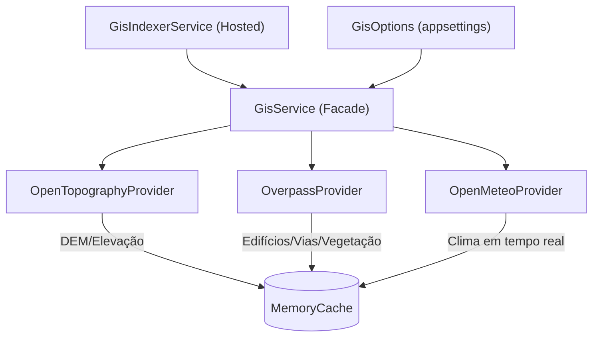
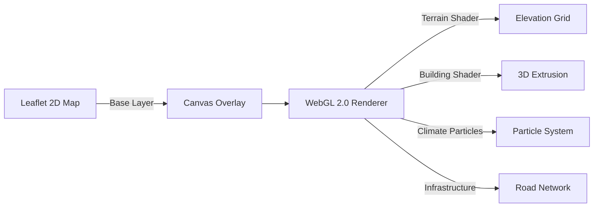
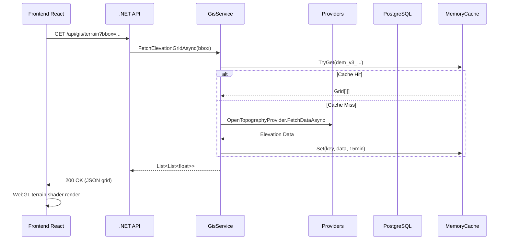

# SOS Location — Arquitetura do Sistema (v3.0)

Este documento descreve a arquitetura técnica da plataforma **SOS Location**,
incluindo o novo módulo de **City-Scale 3D GIS Simulation** para reconstrução
de cidades inteiras (Brasil e Japão) e suporte a simulações de desastre.

---

## 1. Visão Geral

O SOS Location é uma plataforma de apoio à decisão e coordenação tática para
cenários de desastre. A partir da v3.0, incorpora um motor de **renderização 3D
de cidade**, capaz de indexar topografia, edificações, infraestrutura viária e
vegetação via fontes abertas (Overpass, OpenTopography, Open-Meteo, IBGE,
prefeituras municipais).

---

## 2. Backend (.NET 10 — Clean Architecture + DDD)

### Camadas
| Projeto | Responsabilidade |
|---|---|
| `SOSLocation.API` | Controllers, Middleware, Auth (Keycloak/JWT), SignalR Hubs |
| `SOSLocation.Application` | CQRS (MediatR), DTOs, Use Cases, Validations (FluentValidation) |
| `SOSLocation.Domain` | Entidades, Value Objects, Interfaces de Repositório, Regras de Negócio |
| `SOSLocation.Infrastructure` | EF Core, Dapper, GIS Providers, Background Services, Caching |

### GIS/Clima — Arquitetura de Provedores



**Provedores implementados:**
- **OpenTopographyProvider** — Grade de elevação (DEM SRTMGL1), fallback sintético
- **OverpassProvider** — Edifícios (height, levels, usage), vias, parques, matas
- **OpenMeteoProvider** — Temperatura, umidade, precipitação, vento

**GisIndexerService (BackgroundService):**
- Ciclo configurável via `GisOptions.IndexingIntervalMinutes` (padrão: 30 min)
- Indexa automaticamente regiões de incidentes ativos dos últimos 7 dias
- Pré-aquece o cache para garantir baixa latência nas simulações

### Modelo de Domínio — GeoPoint (v3.0)
```csharp
GeoPoint
├── SoilInfo    (type, stabilityIndex, moistureContent)
├── ClimateInfo (temperature, precipitationRate, windSpeed, ...)
├── TopoInfo    (elevation, slope, aspect)
└── UrbanInfo
    ├── BuildingData[]    (id, coordinates, height, levels, usage, material)
    ├── InfrastructureData[]  (id, type, pavementType, lanes)
    └── VegetationData[]  (id, type, density)
```

### Background Services
| Serviço | Intervalo | Responsabilidade |
|---|---|---|
| `GisIndexerService` | 30 min | Indexa GIS/Clima por incidente ativo |
| `WeatherIndexerService` | 10 min | Indexa clima geral |
| `NewsIndexerService` | 15 min | Agrega notícias de desastre |
| `RiskBackgroundService` | 5 min | Envia dados para ML Risk Unit |
| `AlertsBackgroundService` | 5 min | Agrega alertas (INMET, CEMADEN) |
| `AlertHistoryService` | 1 h | Persiste histórico de alertas |

---

## 3. Frontend (React 19 + Vite)

### Design System — "The Guardian Beacon"
- **Chakra UI** com `theme.ts` customizado (tokens de cor, sombras, tipografia)
- **Glassmorphism Tático**: `backdropFilter`, fundos semi-transparentes, dark-mode padrão
- **Micro-animações**: hover effects, transições suaves em todos os HUDs táticos

### Páginas Principais
| Rota | Componente | Status |
|---|---|---|
| `/` | `PublicPortalMap` | ✅ Tático Shell |
| `/transparency` | `PublicIncidentDashboardPage` | ✅ Glassmorphic |
| `/app/sos` | `SOSPage` | ✅ HUD completo + logout |
| `/app/simulations` | `SimulationsPage` | ✅ Fullscreen 3D |
| `/app/global-disasters` | `GlobalDisastersPage` | ✅ Card Grid |
| `/app/settings` | `SettingsPage` | ✅ Service Health |

### Estratégia de Renderização do Mapa (Híbrida)



**Motor de Simulação 3D (City-Scale):**
- Leaflet como coordenação geográfica base
- WebGL 2.0 para rendering de alta performance (buildings, terrain, climate)
- Dados de edificações: Overpass + fontes municipais (IBGE, prefeituras BR/JP)
- Tiling dinâmico: carrega dados por bbox conforme zoom e viewpoint

---

## 4. Banco de Dados

### PostgreSQL 15 + PostGIS
- Conexão gerenciada via **EF Core 10** (migrations automáticas no startup)
- **Dapper** para queries críticas de leitura (baixa latência)

### Entidades Principais
```
Incident, AttentionAlert, SearchArea, Assignment, RescueGroup
MissionTrack, GamificationRecord, DataSource, MapDemarcation
NewsItem, WeatherIndex, DisasterType, FoundPerson
```

### Estratégia de Caching
- `MemoryCache`: GIS/DEM (15 min), Clima (30 min), Solo/Vegetação (60 min)
- `OutputCache`: API responses (1-10 min por endpoint)

---

## 5. Infraestrutura & Integrações

### Docker Compose (v3.0)
```
postgres          — Banco de dados principal (PostGIS)
keycloak          — SSO/OIDC (Keycloak 26)
backend           — .NET 10 API (porta 8000/8001)
frontend          — React 19 (porta 8088)
risk-analysis     — ML Unit Python/FastAPI (porta 8090)
db-backup         — Backup automatizado
dozzle            — Monitoring de logs (porta 9999)
gis-tile-server   — (planejado) Tile cache para dados GIS
```

### Variáveis de Ambiente (`.env.example`)
```env
OPENTOPOGRAPHY_URL=https://portal.opentopography.org/API/globaldem
OVERPASS_URL=https://overpass-api.de/api/interpreter
OPENMETEO_URL=https://api.open-meteo.com/v1/forecast
GIS_INDEXING_INTERVAL_MINUTES=30
GIS_CACHE_EXPIRATION_MINUTES=15
```

### Fluxo de Dados



---

## 6. Fontes de Dados para Simulação 3D

| Fonte | Dados | Cobertura |
|---|---|---|
| OpenTopography (SRTMGL1) | Elevação 30m | Global |
| Overpass API (OpenStreetMap) | Edifícios, vias, vegetação, parques | Global (BR + JP) |
| Open-Meteo | Temperatura, vento, precipitação | Global |
| IBGE API | Municípios, regiões, censo | Brasil |
| Prefeituras Municipais | Plantas cadastrais, gabaritos | BR (quando disponível) |
| G-XML / Kokudo Suuchi | Mapas topográficos e cadastro | Japão |

---

**SOS Location © 2026** — *Arquitetura projetada para salvar vidas através de tecnologia resiliente.*
