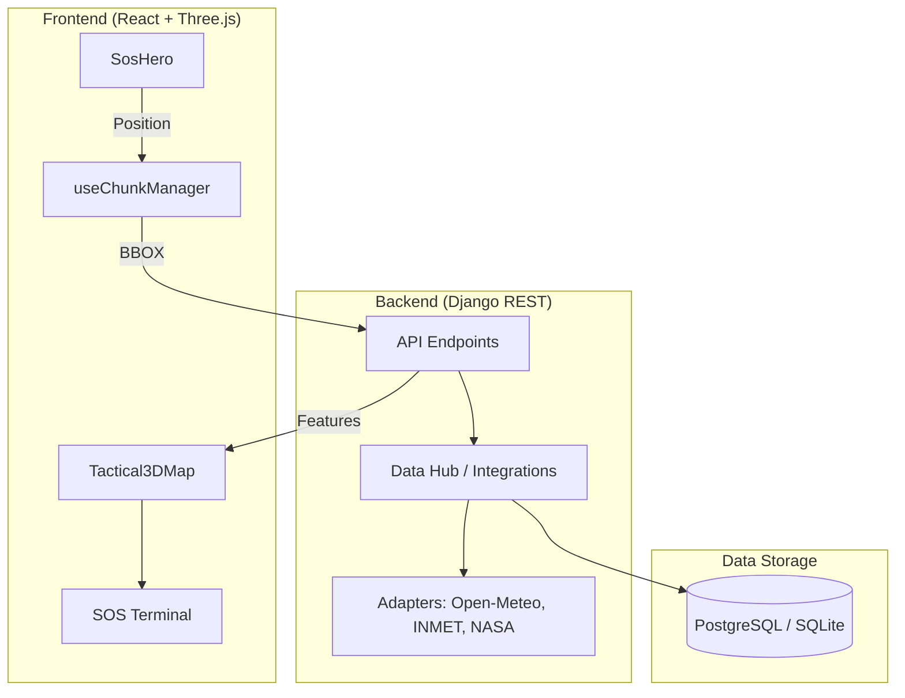

# Arquitetura SOS Location

## Visão de Alto Nível

```mermaid
graph TD
    subgraph "Frontend (React + Three.js)"
        UI[SOS Terminal]
        Map[Tactical3DMap]
        Chunk[useChunkManager]
        Hero[SosHero]
    end

    subgraph "Backend (Django REST)"
        API[API Endpoints]
        Hub[Data Hub / Integrations]
        Adapters[Adapters: Open-Meteo, INMET, NASA]
    end

    subgraph "Data Storage"
        DB[(PostgreSQL / SQLite)]
    end

    Hero -->|Position| Chunk
    Chunk -->|BBOX| API
    API --> Hub
    Hub --> Adapters
    Hub --> DB
    API -->|Features| Map
    Map --> UI
```
